## Места, в которых требуются правки

### Интерфейс программы

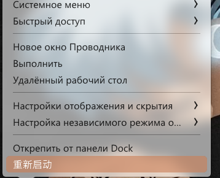

↑ Остался перевод на китайском

### Настройки программы  

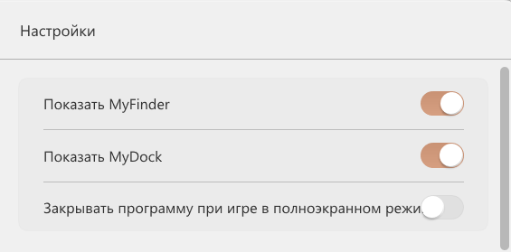

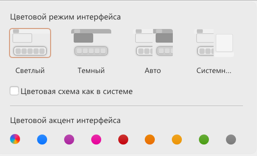

↑ Мб всё же не цветовой режим? Поресёрчить

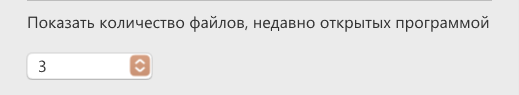

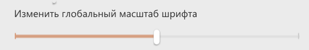

↑ «Масштаб» шрифта?

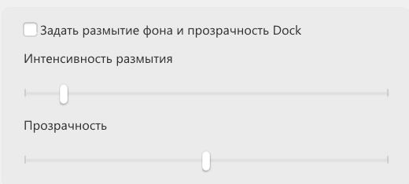

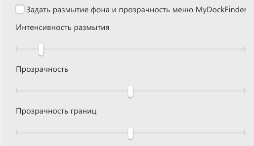

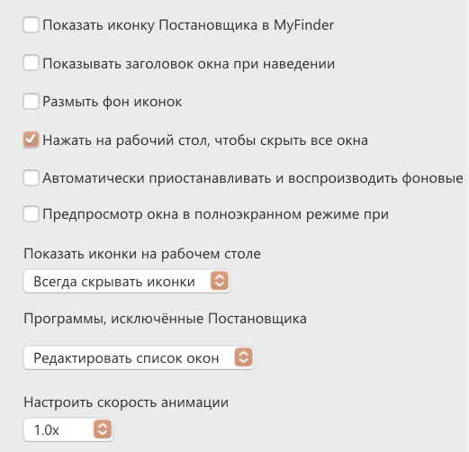

↑ Текст несогласован, поправить

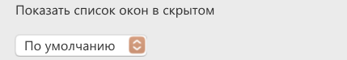

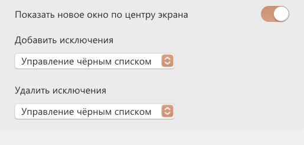

↑ Мб «Показывать»?

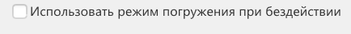

↑ Понять, что это

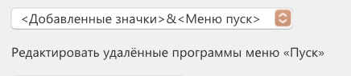

↑ Глянуть, можно ли скорректировать текст из выпадающего списка

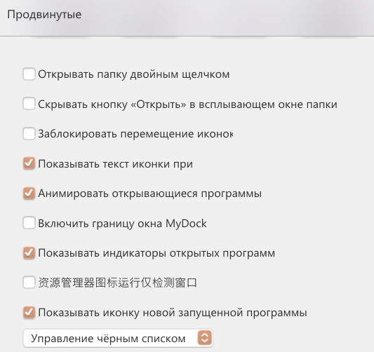

↑ Не переведён пункт меню

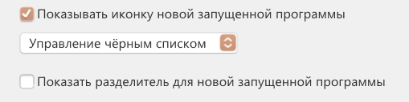

↑ Есть несогласованность, поправить

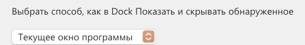    

↑ Поправить

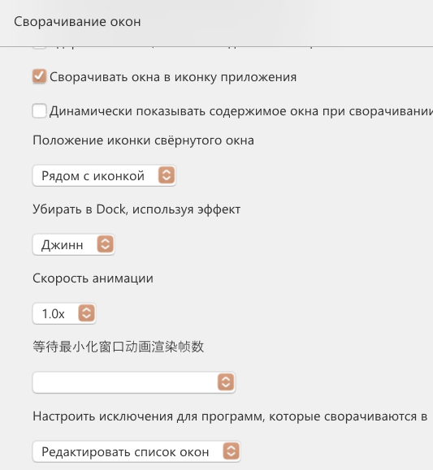

↑ Не переведён пункт меню

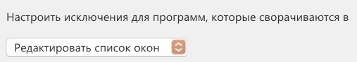

↑ Не помещается текст в окно программы

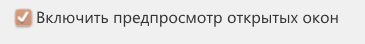

↑ Могут ли окна быть закрытыми? 🤔

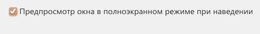

↑ Чуть-чуть текст не помещается

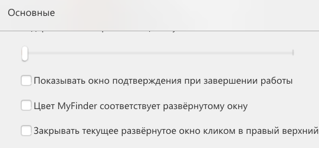

↑ Текст не помещается в окно программы

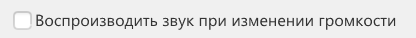

↑ Доуточнить формулировку

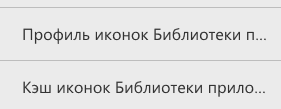

↑ Не помещается текст в поле. Мб заменить Библиотеку приложений на Launchpad? В макоси он так и называется, без перевода

### Мастерская   

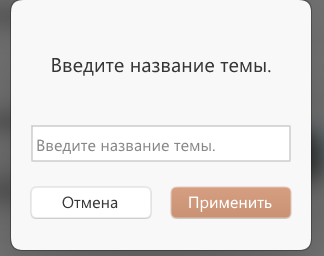

↑ Точка 🙄

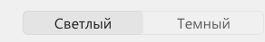

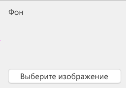

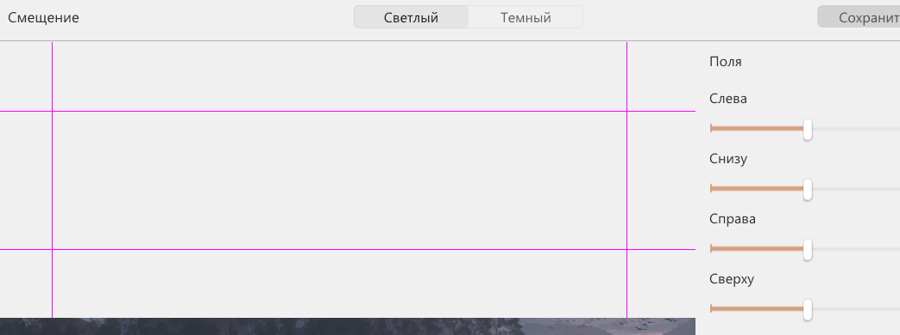

↑ Доуточнить, что смещается

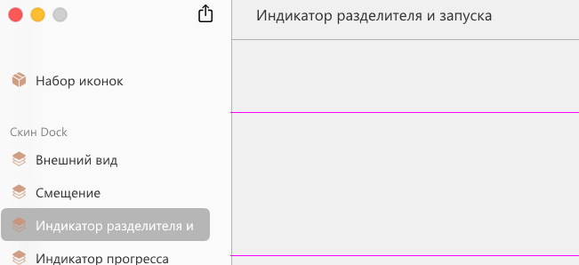

↑ Текст не помещается в боковом меню

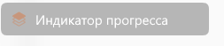

↑ Какого прогресса? Чего прогресса?

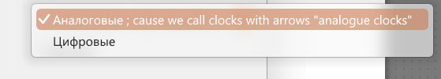

↑ Комментарий проник на прод

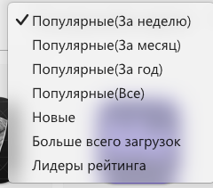

↑ Не хватает пробела
